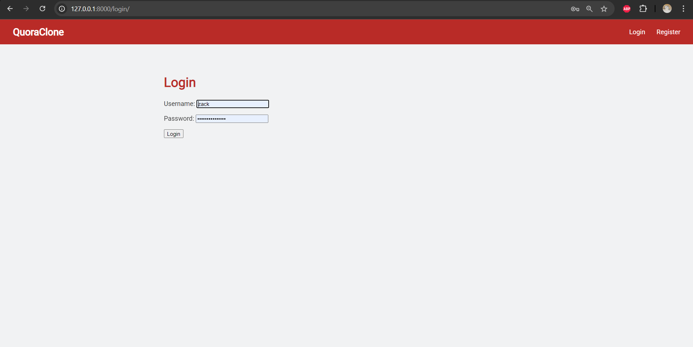
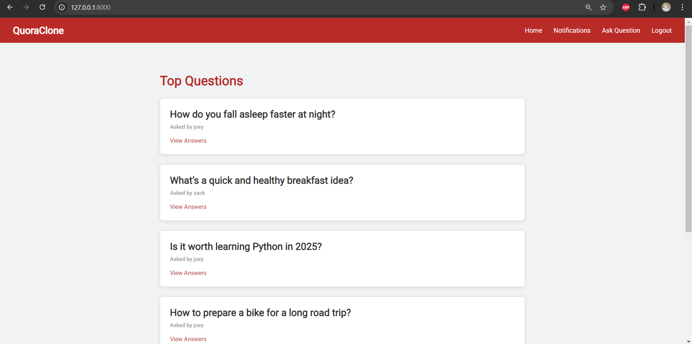
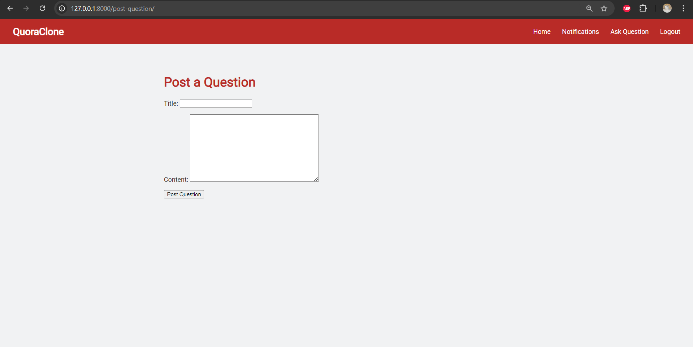
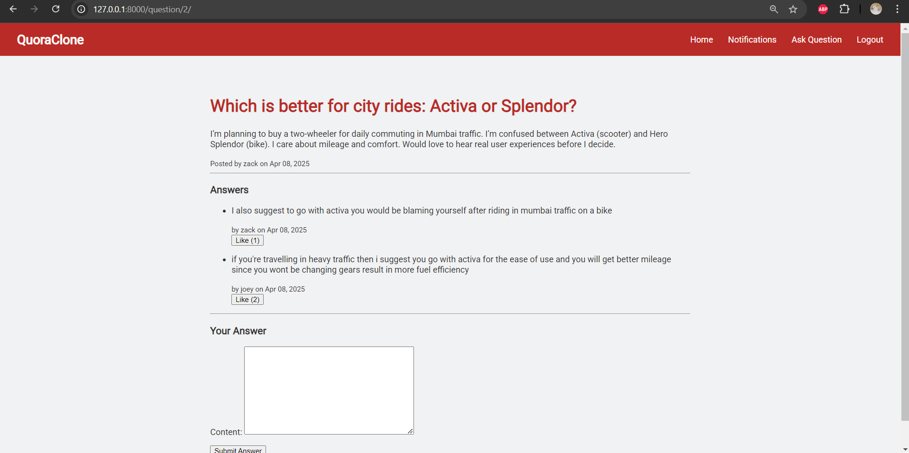
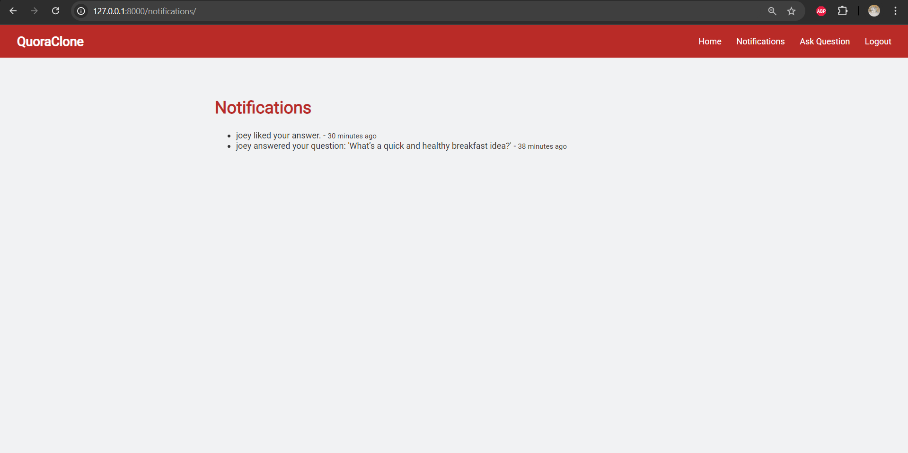

# 🧠 Quora Clone - Django Project

## Hey Team at Transport Simple! hope you like the project that i made.

A clone of Quora built using Django. This web app allows users to register, ask questions, post answers, like responses, and get notified when their question gets a new answer or their answer is liked.
Made for assignment by Transport Simple

---

## 🚀 Features

- 🔐 User Registration & Authentication
- 📝 Post & View Questions
- 💬 Answer Questions
- 👍 Like Answers
- 🔔 Notifications for:
  - New answers on your question
  - Likes on your answer
- 🧭 Simple and responsive UI

---

## 📷 Screenshots

### 🔐 Login Page


### 🏠 Home Page


### ✍️ Ask a Question


### 💬 View Question & Answers


### 🔔 Notifications Page


---

## 🛠️ Setup Instructions

### 1. Clone the repo
```
bash
git clone https://github.com/your-username/quora-clone-django.git
cd quora-clone-django
```

### 2. Create a virtual environment
```
python -m venv venv
source venv/bin/activate     # For macOS/Linux
venv\Scripts\activate        # For Windows
```

### 3. Install dependencies
```
pip install -r requirements.txt
```

### 4. Migrate the database
```
python manage.py makemigrations
python manage.py migrate
```

### 5. Create superuser (optional)
```
python manage.py createsuperuser
```

### 6. Run the development server
```
python manage.py runserver
```

Visit http://127.0.0.1:8000 in your browser.